# LLM Serving Scheduler Lab: simulation study

**Result type: SIMULATED. No hardware inference measurements were performed.**

Source commit: `096b30fbb721a142dd81faa2c7359fbc3b2a4bf8`. Core source SHA-256: `764eb8ee10ddbf170b6d022e2aa09a09c7a224f5976aca3a91a748e6f465777a`.
Study: 955 trials; five workload seeds (101, 202, 303, 404, 505).
The [manifest](results/release/manifest.json) records complete configuration, environment, and checksums.
Tables average per-seed metrics. Milliseconds below are synthetic model time.

## 1. Question and principal result

How do serving schedulers trade first-token latency, token delivery latency, throughput, and
iteration regularity when prefill and decode share one execution resource?

There is no universal winning chunk size in this study. In E2's piecewise model at 64 requests/s,
chunk 128 changes mean TPOT P95 by -70.23% relative to monolithic prefill.
The same policy increases TTFT and decreases throughput. Reporting only decode latency would hide
that cost. This negative result is retained rather than tuning coefficients to force a speedup.

| Metric | Mean paired delta | Relative change | Paired 95% interval |
| --- | --- | --- | --- |
| ttft_p95_ms | 2,472.62 | 154.07% | [145.93%, 165.39%] |
| tpot_p95_ms | -9.50 | -70.23% | [-73.46%, -67.68%] |
| itl_p99_ms | -82.67 | -95.13% | [-95.38%, -94.80%] |
| request_throughput_rps | -11.08 | -35.02% | [-37.49%, -32.78%] |

Relative changes use paired seeds and the ratio of means. Negative latency changes are improvements;
negative throughput changes are regressions. Confidence intervals describe seed variability only.

## 2. Background and scope

[Orca](https://www.usenix.org/conference/osdi22/presentation/yu) introduces iteration-level scheduling.
[Sarathi-Serve](https://www.usenix.org/conference/osdi24/presentation/agrawal) motivates chunked prefills
and the throughput-latency trade-off. These are conceptual references, not reproduced performance results.

The lab defaults to the first output at final-prefill completion, followed by O-1 decode steps.
Prefill has many prompt tokens to process; decode selects one next token per request. Their distinct
batch costs motivate the experiment. The implementation does not execute a transformer, GPU kernels,
a paged KV allocator, or a distributed pipeline. It does not claim to implement vLLM or Sarathi-Serve.

## 3. Architecture and assumptions

```text
JSON/YAML suite or CSV request trace
    -> seeded arrival and length streams
    -> waiting queue + resident request states
    -> scheduler plan
    -> independent hard-limit validation
    -> policy-independent cost model
    -> batch-end state transitions and token timestamps
    -> verified artifacts -> seed-level statistics -> static figures and this report
```

Default common limits are 32 batch slots, 32 residents, 16,384 processed tokens/iteration, and one
prefill request/iteration. Prompt length is at most 8,192. Whole prompts cannot bypass the token budget.
No admission occurs mid-iteration. Requests remain resident until completion. Empty eligible plans,
invalid allocations, dropped requests, and iteration-limit exhaustion fail explicitly.

Serial FCFS serves one whole request at a time. `mono` admits whole prompts beside ready decodes.
`chunk_N` uses the same ordering but limits each selected prefill to N tokens. Aging prefill ordering
and prefill-first priority are separate ablations. The optional KV reservation proxy is tested but
disabled in these main sweeps. See [full semantics and formulas](docs/METHODOLOGY.md).

## 4. Timing models and workloads

The analytical model adds fixed overhead, linear prefill work, linear/quadratic decode work, and
optional context terms. The piecewise model changes efficiency at prompt/batch knees and accounts
for shared decode cost. A trace adapter bilinearly interpolates a complete grid. Its bundled grid
is synthetic. All model inputs and coefficients are in each run's metadata; the policy name is
never passed to a cost model.

Poisson, synchronized burst, and closed-loop sources cover four bounded length regimes. Independent
random streams preserve lengths when arrival processes change. Open-loop policies replay identical
arrival/length hashes. Closed-loop policies share request templates and a client-submission rule;
their actual arrival times necessarily differ. E5 injects one large prompt after a running stream.

| Experiment | Executed trials |
| --- | --- |
| E1 | 40 |
| E2 | 90 |
| E3 | 180 |
| E4 | 120 |
| E5 | 40 |
| E6 | 60 |
| E7 | 50 |
| E8 | 195 |
| E9 | 120 |
| E10 | 60 |

[The predefined design](docs/EXPERIMENT_PLAN.md) specifies every sweep. E1-E8 are the requested main
experiments. E9 tests fixed concurrency. E10 tests resident/prefill limits. No trials or seeds were
removed because they gave unfavorable results.

## 5. Metrics and uncertainty

TTFT is arrival-to-first-output. TPOT is a request's average gap after its first output. E2E is
arrival-to-completion. O=1 has undefined TPOT and contributes no TPOT sample. ITL reports individual
token gaps and can expose stalls hidden by request averages. P50/P95/P99 use linear interpolation.

Cohort throughput includes idle time and drain. Arrival-window throughput excludes drain and is
reported with final-arrival backlog. Logical token counts and processed token counts are separate.
Iteration CV, busy fraction, and slot occupancy are simulation proxies, not measured GPU utilization
or pipeline bubbles. No pipeline exists in this model.

Statistics use 2,000 bootstrap samples at the workload-seed level, with paired seed resampling for
deltas and ratio-of-means changes. The artifact includes mean, median, sample standard deviation,
95% intervals, and paired d_z where defined. No p-value or significance claim is manufactured.
Five seeds give limited uncertainty resolution, especially for P99 from small finite cohorts.

## 6. E1: baseline comparison

Configured arrival rate: 16 requests/s. Each run contains 256 requests. A low serial TPOT does not
mean good service: FCFS can make requests wait a long time before producing anything.

| Cost model | Policy | TTFT P95 mean [95% CI], ms | TPOT P95, ms | ITL P99, ms | Cohort requests/s |
| --- | --- | --- | --- | --- | --- |
| analytical | fcfs | 2,358.34 [1,520.65, 3,242.21] | 0.32 | 0.32 | 15.12 |
| analytical | mono | 853.23 [258.42, 1,457.20] | 16.29 | 87.63 | 15.52 |
| analytical | chunk_128 | 1,016.71 [558.90, 1,585.22] | 5.87 | 6.86 | 16.21 |
| analytical | chunk_512 | 893.69 [353.84, 1,469.09] | 12.34 | 16.61 | 15.64 |
| piecewise | fcfs | 14,117.24 [12,249.54, 16,168.45] | 0.83 | 0.83 | 8.65 |
| piecewise | mono | 92.35 [90.03, 95.63] | 3.59 | 13.74 | 16.74 |
| piecewise | chunk_128 | 772.71 [489.34, 1,202.06] | 3.87 | 4.10 | 16.59 |
| piecewise | chunk_512 | 251.80 [195.63, 326.22] | 5.90 | 10.03 | 16.69 |

The analytical and piecewise models disagree on some benefits. This is evidence of model sensitivity,
not a reason to discard either baseline.

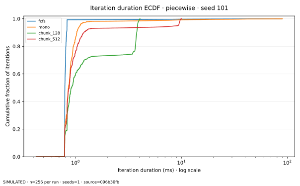

The ECDF is the explicitly selected seed 101, not a multi-seed confidence interval. Histogram
rounding is used only for this plot. Unrounded metrics remain in the result table.

## 7. E2: chunk-size ablation

Piecewise model, 128 requests/run, configured arrival rate 64 requests/s:

| Policy | TTFT P95, ms | TPOT P95, ms | ITL P99, ms | Cohort requests/s | Iteration CV |
| --- | --- | --- | --- | --- | --- |
| mono | 1,604.89 | 13.52 | 86.90 | 31.64 | 2.41 |
| chunk_32 | 5,718.74 | 1.41 | 1.48 | 16.45 | 0.10 |
| chunk_64 | 4,671.53 | 2.29 | 2.38 | 18.95 | 0.20 |
| chunk_128 | 4,077.50 | 4.03 | 4.23 | 20.56 | 0.37 |
| chunk_256 | 3,772.76 | 7.41 | 7.82 | 21.18 | 0.61 |
| chunk_512 | 2,446.40 | 9.89 | 10.80 | 26.48 | 0.84 |
| chunk_1024 | 1,942.05 | 12.10 | 16.35 | 29.24 | 1.12 |
| chunk_2048 | 1,737.13 | 12.74 | 27.15 | 30.65 | 1.48 |

Smaller chunks reduce individual decode stalls and often regularize iterations. Extra small-chunk
work and scheduling overhead can delay prefill completion. Large chunks approach monolithic behavior.

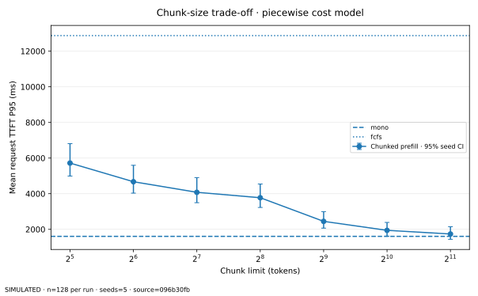
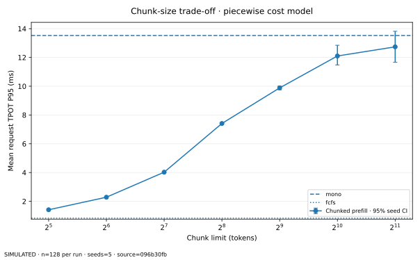
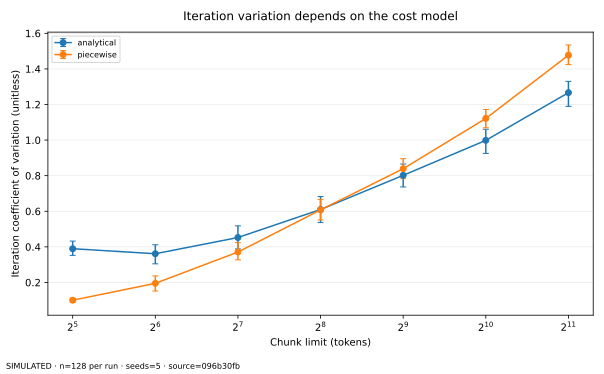
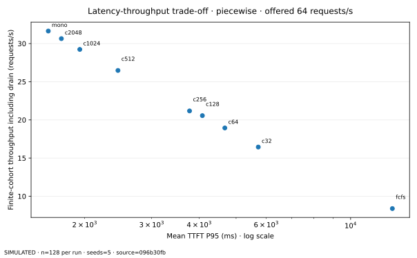

In this two-objective TTFT/throughput view, monolithic prefill dominates the chunked means for this
particular piecewise workload. Decode latency is omitted from that frontier; adding it changes the
optimization problem. The frontier is descriptive and does not establish statistical dominance.

## 8. E3: finite offered-load saturation

Piecewise model, 256 requests/run:

| Offered req/s | Policy | Arrival-window req/s | TTFT P95, ms | TPOT P95, ms | Final-arrival backlog | Drain, ms |
| --- | --- | --- | --- | --- | --- | --- |
| 2 | fcfs | 2.11 | 252.96 | 0.83 | 1.00 | 150.75 |
| 2 | mono | 2.11 | 83.21 | 1.00 | 1.00 | 150.75 |
| 2 | chunk_512 | 2.11 | 141.12 | 1.10 | 1.00 | 163.29 |
| 8 | fcfs | 8.04 | 2,671.85 | 0.83 | 12.60 | 1,395.84 |
| 8 | mono | 8.43 | 86.38 | 1.76 | 1.60 | 161.85 |
| 8 | chunk_512 | 8.43 | 152.69 | 2.39 | 1.60 | 187.12 |
| 16 | fcfs | 8.30 | 14,117.24 | 0.83 | 129.80 | 14,518.50 |
| 16 | mono | 16.79 | 92.35 | 3.59 | 2.60 | 195.46 |
| 16 | chunk_512 | 16.76 | 251.80 | 5.90 | 3.00 | 233.18 |
| 32 | fcfs | 8.56 | 21,245.69 | 0.83 | 191.00 | 22,086.30 |
| 32 | mono | 30.83 | 384.50 | 10.41 | 22.40 | 531.72 |
| 32 | chunk_512 | 25.52 | 1,301.68 | 9.62 | 62.20 | 1,624.19 |
| 64 | fcfs | 8.48 | 24,841.56 | 0.83 | 223.80 | 25,872.04 |
| 64 | mono | 28.38 | 3,153.94 | 11.82 | 147.80 | 3,802.40 |
| 64 | chunk_512 | 22.13 | 4,529.53 | 9.72 | 171.40 | 5,232.77 |
| 128 | fcfs | 8.52 | 26,637.86 | 0.83 | 239.80 | 27,767.42 |
| 128 | mono | 23.57 | 4,904.77 | 11.92 | 210.60 | 5,664.36 |
| 128 | chunk_512 | 18.21 | 6,282.50 | 9.76 | 221.00 | 7,096.27 |

The fixed request count makes high-load arrival windows shorter. Startup and queueing can lower
arrival-window completions even when cohort throughput is stable. The curve is not a steady-state
capacity benchmark. Growing backlog, drain time, and late-half TTFT corroborate overload. FCFS TPOT
can remain flat because it serializes requests; that does not prevent queueing failure.

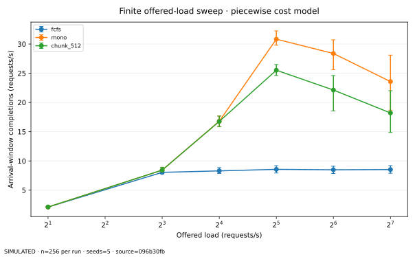
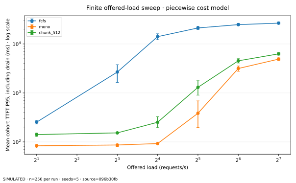

## 9. E4 and E6: workload and burst sensitivity

Piecewise model, four length regimes at 16 requests/s:

| Regime | Policy | TTFT P95, ms | TPOT P95, ms | Cohort requests/s |
| --- | --- | --- | --- | --- |
| short_short | fcfs | 39.61 | 0.79 | 17.91 |
| short_short | mono | 5.42 | 1.04 | 17.91 |
| short_short | chunk_512 | 5.42 | 1.04 | 17.91 |
| long_short | fcfs | 1,883.09 | 0.83 | 14.24 |
| long_short | mono | 523.69 | 55.08 | 17.26 |
| long_short | chunk_512 | 3,712.07 | 9.60 | 11.65 |
| short_long | fcfs | 19,714.06 | 0.79 | 4.61 |
| short_long | mono | 6.12 | 1.24 | 17.22 |
| short_long | chunk_512 | 6.12 | 1.24 | 17.22 |
| mixed | fcfs | 7,863.50 | 0.83 | 8.37 |
| mixed | mono | 96.60 | 4.18 | 17.46 |
| mixed | chunk_512 | 271.96 | 7.05 | 17.30 |

The same chunk size interacts differently with short prompts, long prompts, and long outputs.
Burst E6 uses identical token lengths with Poisson or grouped arrivals. Configured mean rate is the
same; the realized finite arrival span is not forced to match exactly.

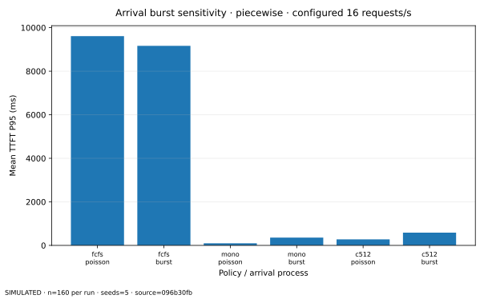

## 10. E5: head-of-line blocking is not one problem

The first request is a running stream. The next has an 8,192-token prompt. Later requests are short.
The table separates the stream's maximum token gap from the short-request waiting outcome.

| Model | Policy | Stream max ITL, ms | Short-prompt TTFT P95, ms | Large-prompt TTFT, ms |
| --- | --- | --- | --- | --- |
| analytical | mono | 147.78 | 430.66 | 148.10 |
| analytical | chunk_64 | 1.48 | 447.34 | 181.32 |
| analytical | chunk_64_aging | 5.41 | 285.06 | 494.50 |
| piecewise | mono | 89.55 | 219.43 | 89.60 |
| piecewise | chunk_64 | 2.07 | 402.20 | 257.32 |
| piecewise | chunk_64_aging | 2.47 | 155.92 | 407.91 |

Chunking alone protects the running stream from one long uninterrupted prefill batch. FCFS prefill
order can still make short waiting requests wait through all chunks. Aging serves other waiting
prefills earlier, but can delay the large prompt. That fairness trade-off is visible, not hidden.

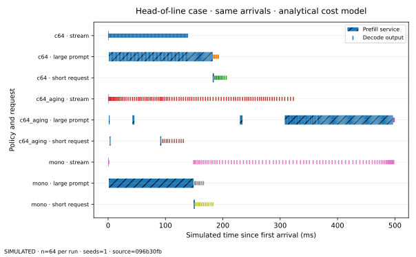

The timeline shows seed 101 and requests 0, 1, and 2 only. Hatched intervals are prefill service;
vertical marks are decode outputs. Omitted requests still consume capacity and remain in raw traces.

## 11. E7: fairness and priority

Piecewise model at 64 requests/s:

| Policy | Waiting-satisfaction Jain | Maximum wait, ms | Requests with gap >1 s |
| --- | --- | --- | --- |
| fcfs | 0.467 | 19,683.791 | 179.200 |
| mono | 0.851 | 2,405.791 | 103.200 |
| chunk_512 | 0.801 | 3,508.705 | 130.200 |
| chunk_512_aging | 0.772 | 3,418.446 | 118.200 |
| chunk_512_prefill_first | 0.801 | 3,508.705 | 130.200 |

The Jain index measures equality of a defined waiting-satisfaction transform. It is not a fairness
certificate. The threshold count means a service gap exceeded one second, not infinite starvation.
Prefill-first and decode-first may coincide when residual capacity is not restrictive; identical
results are valid. Finite completion does not prove liveness for an infinite arrival stream.

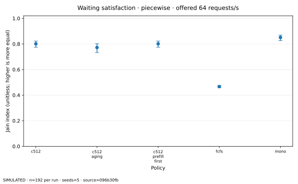

## 12. E8: cost-model sensitivity

Chunk 512 relative to `mono`, configured arrival rate 32 requests/s:

| Cost configuration | TTFT change | TPOT change | Throughput change |
| --- | --- | --- | --- |
| a_p0.5_d0.5 | 13.40% | -32.93% | 0.61% |
| a_p0.5_d1 | 1.97% | -25.52% | 2.10% |
| a_p0.5_d2 | 0.98% | -17.13% | 2.67% |
| a_p1_d0.5 | 0.76% | -38.05% | 1.10% |
| a_p1_d1 | 0.36% | -33.64% | 1.81% |
| a_p1_d2 | 0.48% | -26.54% | 2.39% |
| a_p2_d0.5 | 0.20% | -46.99% | 0.74% |
| a_p2_d1 | 0.30% | -42.32% | 1.29% |
| a_p2_d2 | -0.09% | -34.50% | 1.89% |
| piecewise_mix_0 | 139.94% | -17.20% | -10.86% |
| piecewise_mix_0.25 | 173.05% | -14.26% | -13.61% |
| piecewise_mix_1 | 255.14% | -11.48% | -21.37% |
| trace_demo | 1.51% | -33.24% | 1.32% |

Across the nine analytical coefficient settings, TPOT improvements coexist with modest throughput
changes. The piecewise settings can impose a throughput penalty and much larger TTFT. The synthetic
trace tests interpolation and plumbing; it is not independent hardware evidence. A conclusion that
changes sign across these models must not be promoted as a general GPU finding.

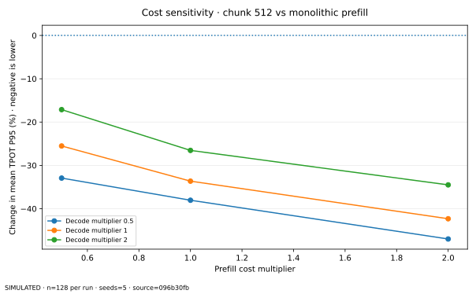

## 13. E9 and E10: submission and resource limits

Closed-loop sources release a replacement on completion, with zero think time in this study.
The same client count is a different load model from a Poisson rate.

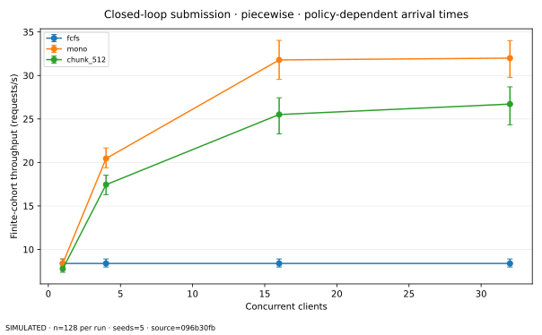

E10 changes resident and per-iteration prefill capacity in the analytical model:

| Residents | Prefills/iteration | Policy | TTFT P95, ms | TPOT P95, ms | Cohort requests/s |
| --- | --- | --- | --- | --- | --- |
| 8 | 1 | mono | 5,370.34 | 6.06 | 16.95 |
| 8 | 1 | chunk_512 | 5,370.30 | 5.34 | 16.95 |
| 8 | 4 | mono | 5,369.73 | 5.97 | 16.95 |
| 8 | 4 | chunk_512 | 5,364.78 | 5.72 | 16.96 |
| 32 | 1 | mono | 5,127.40 | 25.55 | 15.32 |
| 32 | 1 | chunk_512 | 5,128.16 | 16.73 | 15.59 |
| 32 | 4 | mono | 5,143.66 | 26.17 | 15.29 |
| 32 | 4 | chunk_512 | 5,069.39 | 24.37 | 15.35 |

Resource limits and admission order are part of the scheduler definition. A comparison that changes
these silently would not isolate chunking. The primary experiments keep them fixed.

## 14. Validation and adversarial review

The supplied seven-test baseline remains in Git history. The revised suite tests hand-calculated
timestamps, O=1, duplicate IDs, nonfinite inputs, combined budgets, invalid plans, idle jumps,
iteration limits, decode rotation, KV reservations, CSV validation, and exact replay. Randomized
conservation tests cover twelve seeds, three cost models, and four policy variants.

The experiment framework checks duplicate seeds, paired workload hashes, complete conditions,
atomic cache hashes, corruption repair, and dirty-source rejection. The independent artifact checker
validated all 955 rows and eight saved traces. It reconstructs prompt/output counts and checks hard
budgets. Plot tests parse generated SVGs. CI uses Linux and Windows with Python 3.11 and 3.13.

All numeric artifacts are produced by scripts. The experiment design was committed before the formal
run. The host executed the 955-trial simulation; the published release is independently regenerated
in CI. No actual GPU throughput, latency, or utilization measurement occurred.

## 15. Limits and conclusions

The stable mechanisms here are accounting properties: hard budget enforcement, bounded chunk work,
first-token correctness, and the distinction between queue waiting and token stalls. Exact performance
rankings depend on the timing model, arrival regime, sequence limits, and prefill ordering.

This is a single-resource analytical experiment with finite cohorts, bounded synthetic lengths,
five seeds, no calibrated kernels, no transport time, no prefix reuse, no true KV paging/preemption,
no speculative decoding, and no distributed pipeline. Piecewise overlap is an assumption. The
trace adapter lacks context axes. The study cannot establish deployment SLO capacity or production
fairness. The [hardware calibration plan](docs/CALIBRATION.md) specifies the missing measurement work.

Chunking is useful to study because it changes both useful work size and interference. The correct
engineering conclusion is a conditional trade-off, not an unconditional speedup.

## 16. Reproduce and inspect

```bash
python -m pip install -e ".[dev,analysis]"
python -m pytest -q
python -m llm_scheduler_lab run --config configs/study.json --output results/reproduction
python -m llm_scheduler_lab summarize --results results/reproduction --output results/reproduction/statistics
python -m llm_scheduler_lab plot --results results/reproduction --output results/reproduction/figures
python scripts/check_artifacts.py results/reproduction
```

Run the same command again to verify cache reuse. Use a clean committed checkout. `--allow-dirty`
is a debugging option, not a release certification. Compare metric columns with tolerance rather than
UTC/environment fields. See [reproduction details](docs/REPRODUCIBILITY.md),
[per-run CSV](results/release/summary.csv), [aggregates](results/release/statistics/aggregate.csv),
[paired comparisons](results/release/statistics/paired.csv), and [source audit](docs/AUDIT.md).
